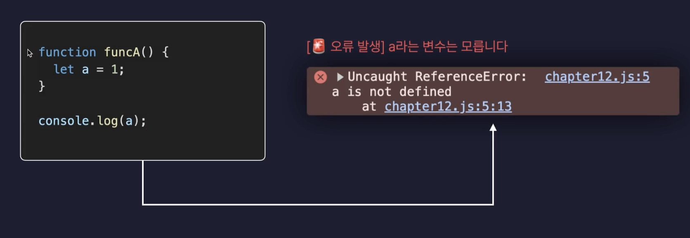

# Javascript 기본

## 10.반복문

- 어떠한 동작을 반복해서 수행할 수 있도록 만들어주는 문법

### for

```javascript
for(초기식; 조건식; 증감식){
  console.log('반복!')
}
```

- 초기식 : 변수
- 조건식 : 참인 경우 코드 실행
- 증감식 : 초기식의 변수를 증가해주는 식

#### 반복문을 멈추고 싶을 경우 :  `break`

```javascript
for(let idx=0; idx < 10; idx++){
  console.log(idx);  // 0,1,2,3,4,5
  if(idx >= 5){
    break;
  }
}
```

#### 반목문의 특정 회차에 대한 조건을 넣고 싶을 경우 : `continue`

```javascript
for(let idx=0; idx < 10; idx++){
  if(!(idx%2)){
    continue;
  }
  console.log(idx);

  if(idx >= 5){
    break;
  }
}
```

<br/>

## 11.함수

- 공통으로 자주 사용되는 코드들을 묶어 이름을 붙여 정의해두고 필요할 때 마다 편하게 쓸수 있도록 해주는 자바스크립트 문법

#### 함수 선언

- 실행하고 싶은 함수들은 미리 선언해둔다.

```javascript
function greeting(){
  console.log('안녕하세요~');
}
```

#### 함수 호출

- `()`와 함께 호출하게 되면 함수 실행된다.

```javascript

function greeting(){
  console.log('안녕하세요~');
}

greeting();
```

#### 함수호출시 `인수` , 함수선언시 `매개변수`

```javascript

function getArea(width, height){ // 👈🏻 매개변수
  let area = width * height; 
  console.log(area); 
}

getArea(10,20); // 👈🏻 인수 
```

#### 함수의 반환값 `return`

- return는 함수를 반환하면서 함수를 종료시킴

```javascript
function getArea(width, height){
  function another(){
    console.log('중첩함수');
  }
  let area = width * height; 
  return area; // 👈🏻 반환하고 함수를 종료한다.
}
```

- return 기재하지 않았다면?  `undefined` 가 기본적으로 반환된다.

```javascript
function returnCheck(){
  const check = 'return을 적어주지 않는다면?'; 
}

const what = returnCheck();
console.log(what); // undefined
```

#### ⤴ 호이스팅

- 함수선언보다 함수호출 부분이 먼저 입력되었지만 함수는 실행된다.
- 호이스팅 현상이 일어나서 error 일어나지 않는다.

> 📖 호이스팅 <br> 코드가 실행하기 전에 특정스코프내에 함수가 최상단으로 끌어올려지는 것처럼 보이는 현상

```javascript

getArea(1000,2000); // 2000000

function getArea(width, height){ 
  let area = width * height; 
  console.log(area); 
  return area; 
}
```

<br/>

## 12. 함수 표현식 & 화살표 함수

### 함수 표현식

- 값으로써 함수를 생성하는 방식 (변수에 함수를 담아 사용하는 방식)
- 호이스팅의 대상이 되지 않음

```javascript
let varB = function (){ // 👈🏻 익명함수
  console.log('funB')
}
varB();
```

### 화살표 함수

- `() => {}` 함수를 간결하게 작성하는 자바스크립트 문법

#### return 생략 가능

```javascript
let varC = () => {
  return 1;
}

let varC_1 = (value) => value + 1; // 👈🏻 생략해서 간결하게 사용
```

<br/>

## 13. 콜백함수(Callback Function)

- 자신이 아닌 다른 함수에, `인수`로써 전달된 함수를 의미

```javascript
function main(value){
  //console.log(value);
  value();
  console.log('end');
}

function sub(){
  console.log('I am sub');
}

main(sub); // 👈🏻 sub : 콜백함수 
```

- 화살표 함수, 함수 표현식 모두 가능

```javascript
main(() => {
  console.log('화살표 함수 가능');
})

main(function(){
  console.log('함수 표현식도 가능')
})
```

### 콜백함수의 활용

- 중복 되는 코드를 간결하게 사용 할 수 있도록 만들어 준다.

```javascript
function repeat(count){
  for(let idx=1; idx<=count; idx++){
    console.log(`repeat : ${idx}`);
  }
}


function repeatCallBack(count, callback){
  for(let idx=1; idx<=count; idx++){
    callback(idx);
  }
}

repeat(5);

repeatCallBack(5, function(idx){
  console.log(`repeatCallBack : ${idx}`);
})

repeatCallBack(5, (idx) => {
  console.log(`repeatCallBack : ${idx * 2}`);
})
```

<br/>

## 14. 스코프(Scope)

- 범위
- __변수나 함수에 접근하거나 호출할 수 있는 범위를__ 말함



> 🚨 변수 a는  funA 함수 내부에 선언되어 있기 때문에 접근 할 수 없어 error 발생

### 전역 스코프

- 전체 영역에서 접근 가능

### 지역 스코프

- 특정 영역에서만 접근 가능
- `{ }` 블록 내부의 선언된 변수, 함수는 지역스코프를 갖게 된다.

```javascript
let all = 1; // 👈🏻 전역 스코프 

function funA() {
  let area = 2 ; // 👈🏻 지역 스코프 
  console.log(all);
}

funA();  // 1 

console.log(area); // area is not defined
```
