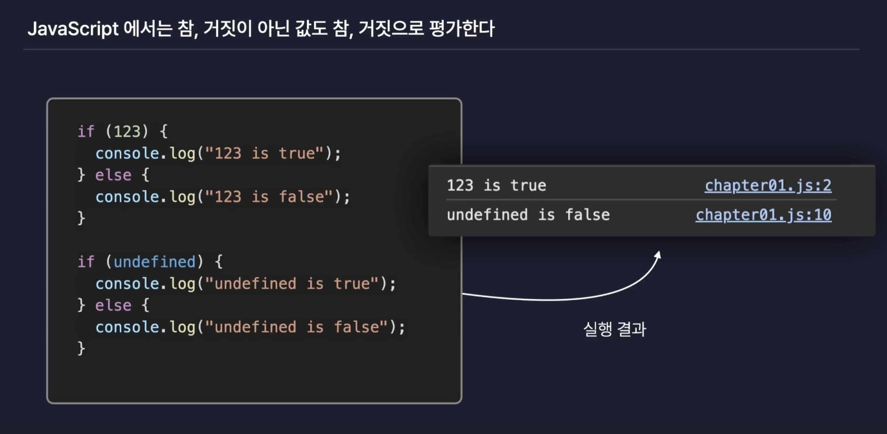
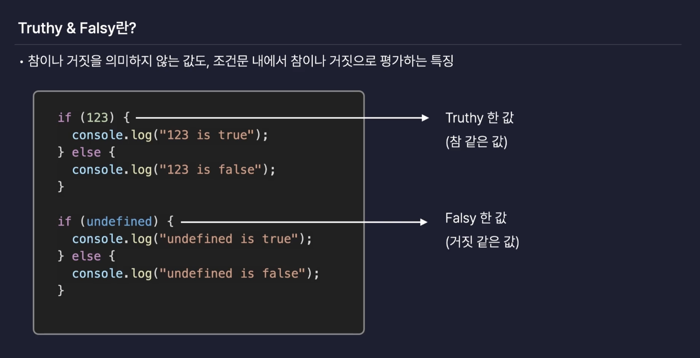
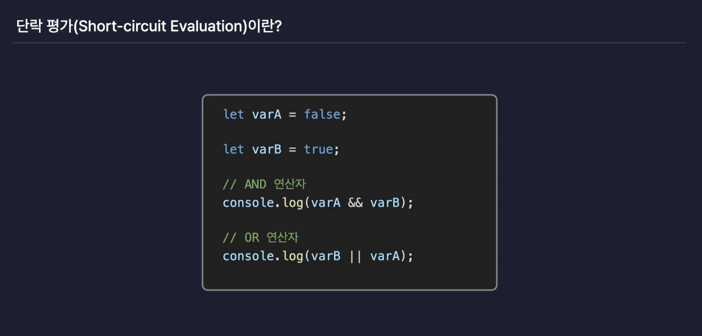

# Javascript 심화

## 1. Truthy 와 Falsy

JavaScript 에서는 참,거짓이 아닌 값도 참,거짓으로 평가한다.



### Truthy & Falsy

- 참이나 거짓을 의미하지 않는 값도, 조건문 내에서 참이나 거짓으로 평가하는 특징
  - 쓰임 : __조건문을__ 간결하게 만들 수 있다.



### Falsy한 값

- undefined
- null
- 0 , -0
- NaN
- 빈문자열
- On

### Truthy한 값

- Falsy한 값들 제외한 나머지 모든 값

#### 활용 사례

```javascript
let person = {name :'홍길동'}

function printName(person){
  if(!person){ // 👈🏻 조건문을 통해 Falsy한 값에 !연산자를 활용해 조건 처리 
    console.log('person의 값이 없음'); 
    return; 
  }
  console.log(person.name);
}

person = null; // 👈🏻 Falsy한 값이 할당 된다면? 
printName(person); 
```

<br/>

## 2. 단락 평가 (Short-circuit Evaluation)

- 논리 연산식에서 첫번째 피연산자의 값만으로도 해당 연산결과를 확정할 수 있다면 그때는 두번째 피연산자에는 접근조차 하지 않는 실행 방식



```javascript
function returnFalse(){
  console.log('False 함수');
  return false; 
}

function returnTrue(){
  console.log('True 함수');
  return true; 
}

console.log(returnFalse() && returnTrue());  // False 함수 false 
                      //  👆🏻 && 연산자는 true && true 값일 경우를 찾는 연산자 
          // 👆🏻 해당 함수실행하니 false 이므로 연산결과를 확정지어 해당함수만 실행하고 종료처리 

console.log(returnTrue() && returnFalse());  // True 함수 False 함수 false   
          // 👆🏻 True 여서 단락평가 수행되지 않음. 연산결과를 확정 할 수 없어서 returnFalse 함수도 실행 됨 

console.log(returnTrue() || returnFalse()); // True 함수 true
            // 👆🏻 해당 함수 실행시 true 여서 연산결과 확정지어 해당 함수만 실행하고 종료처리 
```

### 활용 사례

```javascript
let person = {name :'홍길동'}

function printName(person){
  // if(!person){  // 👈🏻 제거 
  //   console.log('person의 값이 없음'); 
  //   return; 
  // }
  const name = person && person.name
  console.log(name || 'person의 값이 없음');
}

person = null;
printName(person); 
```

### 참고사항

- True || True → 앞부분 True 실행
- True && True → 뒷부분 True 실행
