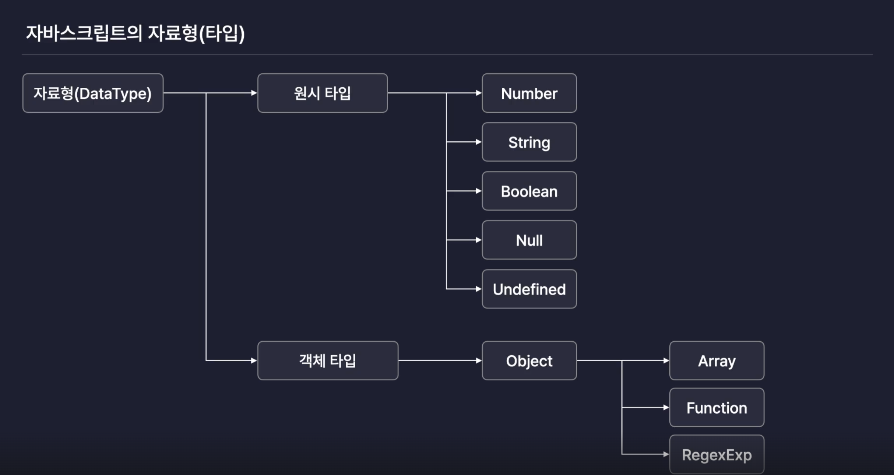
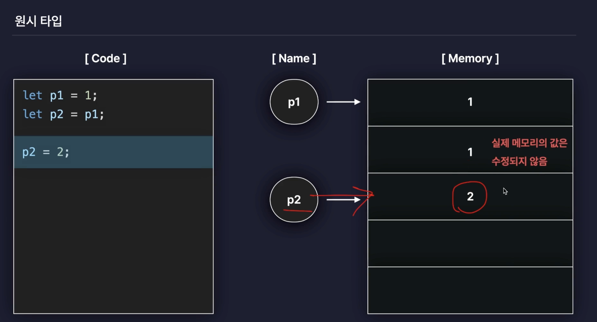
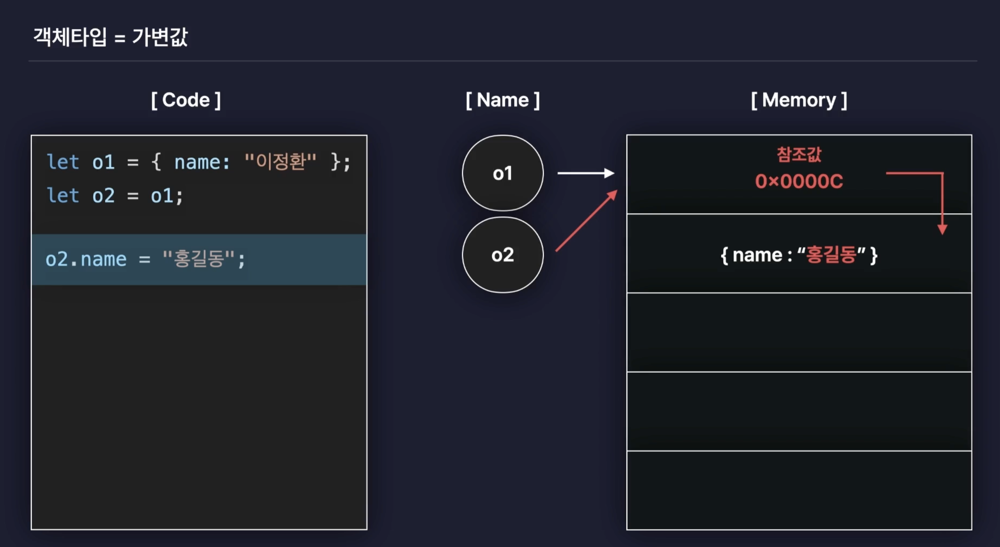
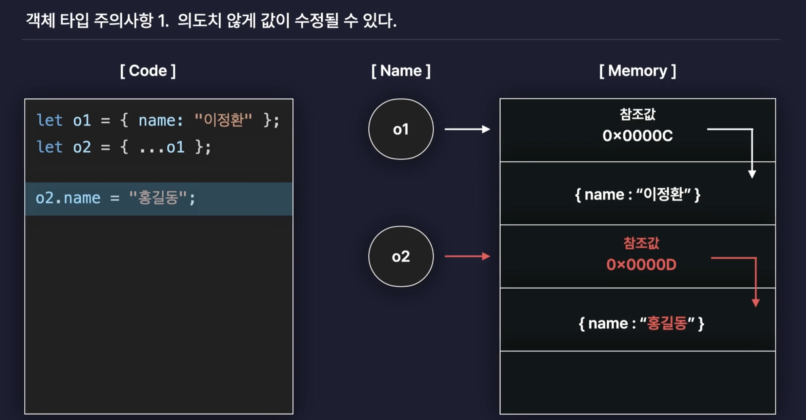
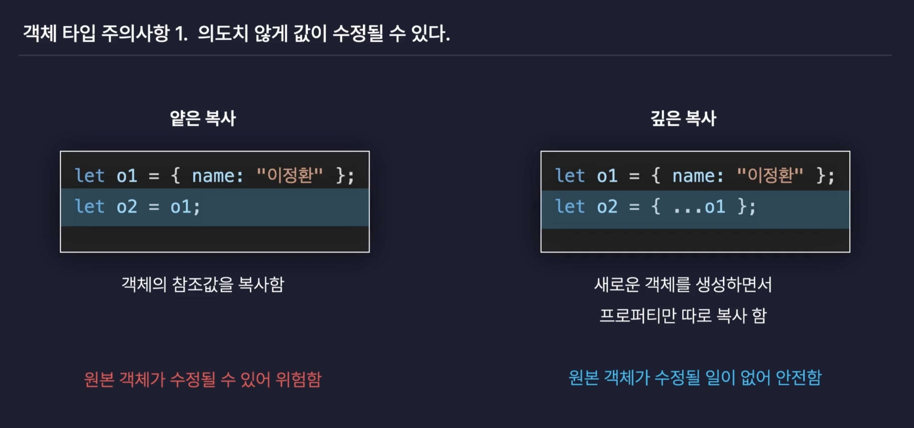
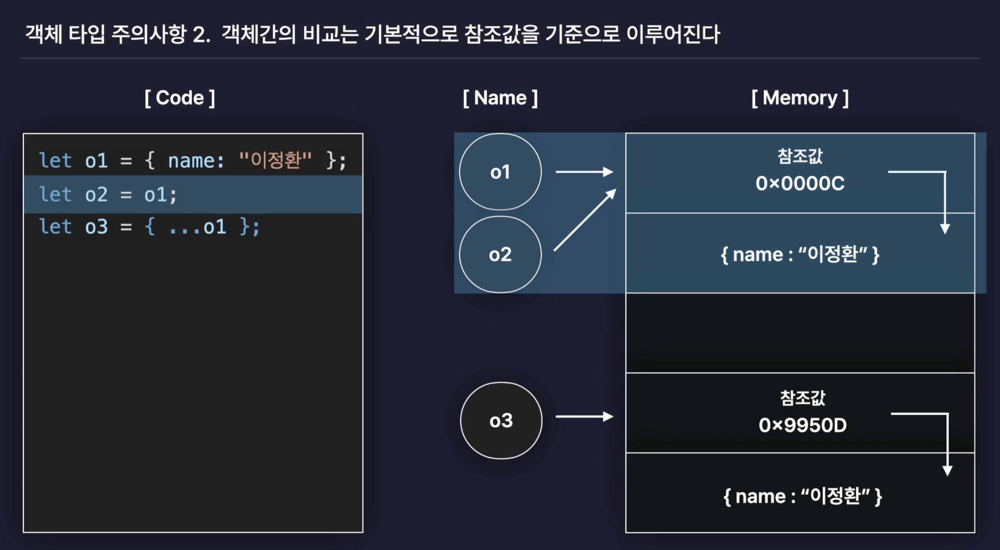
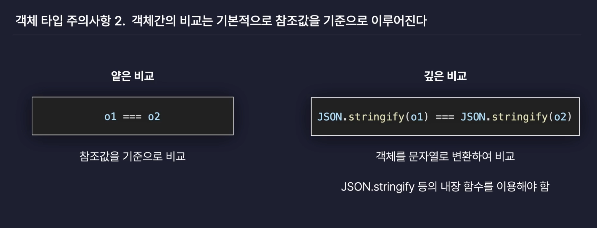

# Javascript 심화

## 3. [구조 분해 할당](https://ko.javascript.info/destructuring-assignment)

- 배열의 원소나  객체의 value 를 각각의 변수로 `분해`할 수 있게 해주는 문법

### 배열의 구조 분해 할당

- `[]`괄호 안에 변수 기재하고 arr 대입
  - 인덱스를 이용해 배열에 접근하지 않고 변수로 접근 가능
- 기존에 없던 값도 추가 할 수 있음.
  - ex. four = 4

```javascript
let arr = [1,2,3];

let [one,two,three, four=4] = arr;
console.log(one, two, three, four);
```

### 객체의 구조 분해 할당

```javascript
let {
  name,
  age : myAge, // 👈🏻 변수 이름 변경 
  hobby, 
  year='2005' // 👈🏻 기존에 없던 값 추가 가능 
} = person; 

console.log(name, myAge, hobby, year);
```

- `{}`괄호 안에 변수 기재하고 person 대입
- 기존에 없던 값도 추가 할 수 있다.
  - ex. year='2005'
- key 값과 동일한 이름이 아닌 다른 이름을 사용 할 수 있다.
  - ex. age : myAge

### 객체 구조 분해 할당을 이용해서 함수의 매개변수를 받는 방법

```javascript
let person = {
  name : '홍길동', 
  age : 20, 
  hobby : '날아다니기',
}

const func = ({name, age, hobby, year='2005'}) => { // 👈🏻 {}을 이용해 매개변수 활용
  console.log(name, age, hobby, year);
}

func(person)
```

<br/>

## 4. Spread 연산자 와 Rest 매개변수

### Spread 연산자 : `...`

> 📖 Spread : 흩뿌리다, 펼치다 라는 의미

- 객체나 배열에 저장된 여러개의 값을 개별로 흩뿌려주는 역활

```javascript
// 배열 
let arr1 = [1,2,3]; 
let arr2 = [...arr1, 4, 5, 6]; 

console.log(arr2);  // [1,2,3,4,5,6]

// 객체 
let obj1 = {
  a : 1, 
  b : 2, 
}

let obj2 = {
  ...obj1, 
  c : 3, 
  d : 4, 
}

console.log(obj2);  // {a: 1, b: 2, c: 3, d: 4}

// 함수 
function func (p1, p2, p3){
  console.log(p1, p2, p3);
}

func(...arr1);
```

### [Rest 매개변수](https://developer.mozilla.org/ko/docs/Web/JavaScript/Reference/Functions/rest_parameters)

- 정해지지 않은 수의 매개변수를 배열로 받을 수 있다.

```javascript
let arr3 = [7,8,9]; 

function funcB (p7, ...rest){
  console.log(rest);
}

funcB(...arr3);
```

- 🚨 주의사항 :  `...rest` 마지막으로 설정 되어야 한다.

```javascript
foo(...wrong, arg2, arg3); ❎ 
foo(arg1, arg2, ...correct); ✅
```

<br/>

## 5. 원시타입 VS 객체타입

### 자바스크립트 자료형



#### 🤔 왜 타입을 나누었을까?

- 원시타입과 객체타입은 값이 저장되거나 복사되는 과정이 서로 다르기 떄문!

### 원시타입 = 불변값

- `값` 자체로써 변수에 저장되고 복사 된다.  



- 변수p2는 변수p1의 값을 할당하면 새로운 메모리에 저장한다.
- 변수p2는 2를 할당 받게되면 원본 메모리의 값은 그대로 두고 새로운 메모리 값을 저장한다.  

### 객체타입 = 가변값

- `참조값`을 통해 변수에 저장되고 복사 된다.  



- 변수o2는 변수o1의 참조값(메모리 주소)을 할당받는다.
- 변수o2의 객체의 값을 재할당하게 되면 참조값(메모리 주소)을 통해 메모리의 값을 변경한다.

#### 객체타입 주의사항

- 의도치 않게 값이 수정 될 수 있다. → Side Effect




기존의 객체를 복사해서 사용하기 보다는 Spread 연산자를 사용해서 새로운 객체를 생성해서 사용

- 객체간의 비교는 기본적으로 `참조값`을 기준으로 이루어진다.




- 배열과 함수도 사실 `객체`이다.

<br/>

## 6. 반복문으로 배열과 객체 순회하기

### 순회

- 배열, 객체에 저장된 여려개의 값에 순서대로 하나씩 접근하는 것을 말함

### 배열 순회

#### 배열의 인덱스 활용

```Javascript
let arr = [1,2,3]; 
let arr2 = [4,5,6,7,8];

for(let i = 0; i < arr.length; i++){
  console.log(arr[i]);
}

for(let i=0; i<arr2.length; i++){
  console.log(arr2[i]);
}
```

#### for of

```Javascript
let arr = [1,2,3]; 

for (let item of arr){
  console.log(item);
}
```

### 객체 순회

#### Object.keys

- 객체의 key값들만 뽑아서 순회해서 새로운 배열로 반환

```javascript
let person = {
  name :'홍길동', 
  age :27,
  hobby : '날아다니기' 
}

let keys = Object.keys(person); 

for(let key of keys){
  let value = person[key]; 
  console.log(key, value);
}
```

#### Object. values

- 객체의 value값들만 뽑아서 순회해서 새로운 배열로 반환

```javascript
let person = {
  name :'홍길동', 
  age :27,
  hobby : '날아다니기' 
}

let values = Object.values(person); 

for(let value of values){
  console.log(value); 
}
```

#### for in

- 객체에서만 사용하는 메서드

```javascript
let person = {
  name :'홍길동', 
  age :27,
  hobby : '날아다니기' 
}

for (let key in person){
  console.log(key);
}
```
