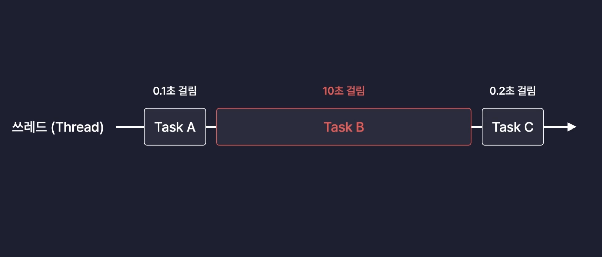
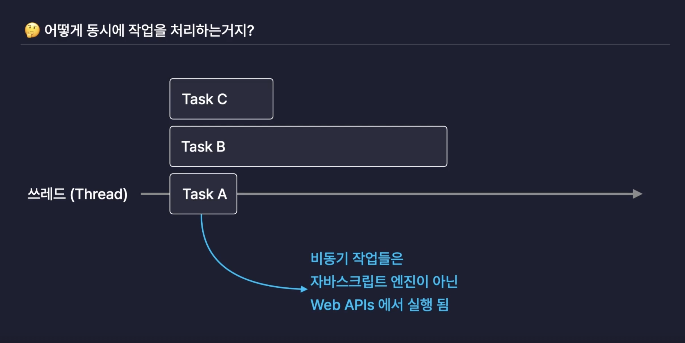
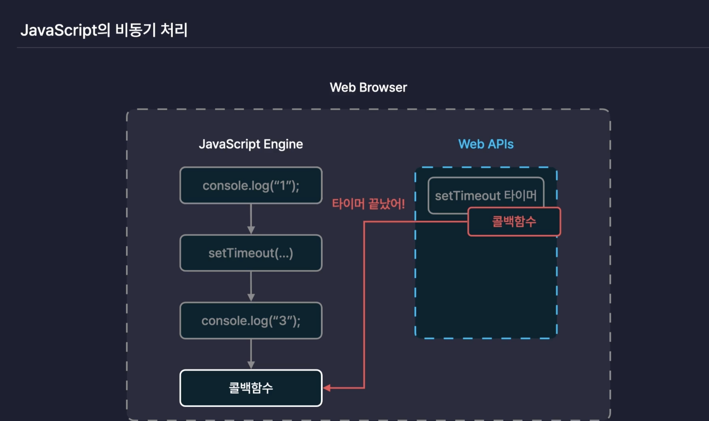
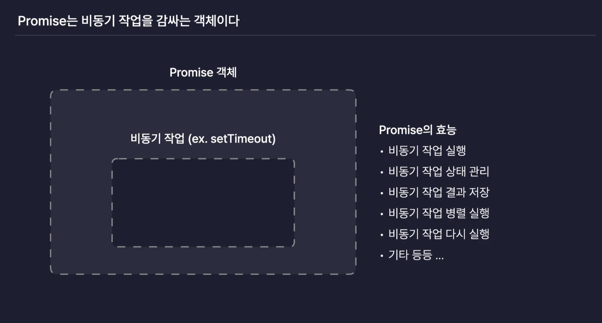

# Javascript 심화

## 11. 동기와비동기

### 동기

- 여러개의 작업을 순서대로, 하나씩 처리하는 방식
- Javascript는 `동기`적으로 코드를 실행한다.

#### 동기 방식에는 치명적인 단점이 존재한다



> Thread가 순서대로 실행하게 되는데 TaskB의 작업이 오래걸리게 된다면 다음작업인 TaskC은 늦게 실행되면 성능 저하로 이어진다.
→ 다른언어들은  해결방식으로 멀티쓰레드로 작업을 분산하지만 자바스크립트 엔진은 싱글쓰레드 방식으로 동작하기 때문에 다른 방식을 찾아야 했다.
그래서 나온 개념이 `비동기` 방식이다.

### 비동기

- 여려개의 작업을 동시에 실행시키는 처리 방식
- 동시에 함수를 실행시킨 후 결과값을 콜백함수에 담아둔다.

#### 🤔 어떻게 동시에 작업을 처리하는거지?

- 비동기 작업들은 자바스크립트 엔진이 아닌 `Web APIs`에서 실행된다.




웹브라우저가 가지고 있는 자바스크립트엔진은 순서대로 코드를 실행하다 비동기 처리의 함수를 만나게 되면
브라우저내의 (1) `Web APIs`에게 비동기 함수를 실행 해달라고 부탁하게 된다. (2) 자바스크립트 엔진은 순서대로 다음작업을 계속 수행하고 (3) `Web APIs`는 전달받은 비동기 함수를 실행을 완료 한 후 콜백함수를 (4) 다시 자바스크립트 엔진에게 전달해서 실행하게 하는 방식으로 처리 한다.

```Javascript
console.log(1); 

setTimeout(() => { // 👈🏻 Web APIs가 setTimeout()함수를 실행하고, 콜백함수를 다시 자바스크립트 엔진에게 전달 
  console.log(2);
},3000);

console.log(3);

// console.log(2)
```

<br/>

## 12. 비동기 작업 처리하기 - 1. 콜백함수

### 콜백함수

- 다른 함수의 매개변수로 전달되는 함수를 의미

```javascript
function add(x,y, callback){
  setTimeout(() => {
    const sum = x + y  // 👈🏻 sum의 변수를 add 함수 외부에서도 사용하고 싶다면 콜백함수를 이용해서 처리 한다. 
    callback(sum);
  },3000)
}

add(1,2, (value) => {
  console.log(value);
});
```

### 콜백지옥

- 비동기 처리의 결과를 또 다른 비동기 작업의 인수로 넣어주는 코드가 반복이 된다면 콜백함수안에서 계속 콜백함수를 호출하는 이러한 문법이 계속 작성 되기 때문에 인덴트(indent: 들여쓰기)가 점점 깊어지는 형태로 진화하게 된다. 코드의 가독성이 안좋아기게 되는데 이러한 상황을 `콜백지옥`이라고 불린다.

```javascript
function orderFood(callback){
  setTimeout(() => {
    const food = '김밥';
    callback(food);
  }, 3000)
}

function coolDownFood(food, callback){
  setTimeout(() => {
    const coolDownedFood = `식은 ${food}`; 
    callback(coolDownedFood);
  }, 2000)
}

function freezeFood(food, callback){
  setTimeout(() => {
    const freezedFood = `냉동된 ${food}`;
    callback(freezedFood);
  }, 1500)
}

orderFood((food) => {
  console.log(food); // 김밥 

  coolDownFood(food, (coolDownedFood) => {
    console.log(coolDownedFood);  // 식은 김밥 
    freezeFood(coolDownedFood, (freezedFood) => {
      console.log(freezedFood); // 얼린 김밥 
    });
  });
});
```

<br/>

## 13. 비동기 작업 처리 하기 - 2. Promise

### [Promise](https://developer.mozilla.org/ko/docs/Web/JavaScript/Reference/Global_Objects/Promise)

- 자바스크립트의 내장 객체
- 비동기 작업을 효율적으로 처리할 수 있도록 도와주는 객체
- 비동기 작업을 감싸주는 객체



### Promise의 3가지 상태

- `Pending` : 아직 비동기 작업이 진행중인 완료되지 않은 상태
- `fulfilled` : 비동기 작업이 성공적으로 마무리 된 상태
- `rejected` : 비동기 작업이 실패한 상태

### Promise 생성자

```javascript
const promise = new Promise(() => {})  // 생성자에 콜백함수를 넣어주는데 이러한 함수를 executor 라고 부른다. 
```

- resolve : 프로미스가 관리하는 비동기 작업을 성공상태로 바꾸는 함수
- reject : 프로미스가 관리하는 비동기 작업을 실패상태로 바꾸는 함수

```javascript
const promise = new Promise((resolve, reject) => {
  // 비동기 작업을 실행하는 함수 
  // executor

  setTimeout((resolve , reject)=> {
    console.log('안녕');
  },3000)
})
```

### 비동기 작업을 실행

- promise 생성자를 통해 비동기 작업을 실행하는 함수를 만들어 비동기 작업을 실행하도록 한다.

```javascript
const promise = new Promise((resolve,reject) => {
  // 비동기 작업을 실행하는 함수 
  // executor
  setTimeout(() => {
    const num = 10; 
    if(typeof num === 'number'){
      resolve(num + 10); 
    }else{
      reject('num이 숫자가 아닙니다.');
    }
  },2000)
}); 
```

### 비동기 작업을 실행하게 해준 후 결과값을 사용을 위해 `than` 과 `catch` 메서드 사용

```javascript
const promise = new Promise((resolve,reject) => {
  // 비동기 작업을 실행하는 함수 
  // executor

  setTimeout(() => {
    const num = 10; 
    if(typeof num === 'number'){
      resolve(num + 10); 
    }else{
      reject('num이 숫자가 아닙니다.');
    }
  },2000)
}); 

// promise의 결과값을 사용하기 위해서 
// than 메서드 
// -> 그 후에 

promise.then((value) => {console.log(value)});

// catch 메서드 
// 실패한 값을 전달 받을 수 있다. 

promise.catch((error) => {console.log(error)});
```

### Promise 체이닝

- Promise 객체의 메서드를 연결지어 사용하는 상황

```javascript
promise
.then((value) => {console.log(value)})
.catch((error) => {console.log(error)});
```

### return로 promise 객체를 반환해서 콜백지옥을 벗어 날 수 있다

```javascript
function sum(num){
  const promise = new Promise((resolve,reject) => {
    // 비동기 작업을 실행하는 함수 
    // executor
  
    setTimeout(() => {
      if(typeof num === 'number'){
        resolve(num + 1); 
      }else{
        reject('num이 숫자가 아닙니다.');
      }
    },2000)
  }); 

  return promise;
}

sum(0).then((result) => {
  console.log(result); 
  return sum(result);  // promise
}).then((result) => {
  console.log(result); 
})

sum(0).then((num) => {
  console.log(num); 
  return sum(undefined); // promise가 실패하는 경우 
}).then((result) => {
  console.log(result);
  return sum(result);
}).then((result) => 
  console.log(result)
).catch((error) =>  // 👈🏻 바로 실패한 코드를 반환하는 해당 catch 메서드가 실행되게 됨.
  console.log(error)
);
```

<br/>

## 14. 비동기 작업 처리 하기 - 3. Async/Await

### async

- 어떤 함수를 비동기 함수로 만들어주는 키워드
- 함수가 프로미스를 반환하도록 변환해주는 키워드

```javascript
async function getDate(){
  return {
    name : '홍길동',
    id : 'hg', 
  }
}

console.log(getDate());  // promise 반환하고 객체안의 결과값에 return문의 객체가 들어 있다. 
```

### await

- async 함수 내부에서만 사용이 가능한 키워드
- 비동기 함수가 다 처리되기를 기다리는 역활

```javascript
function delay(ms) {
  return new Promise((resolve, reject) => {
    setTimeout(() => {
      resolve();
    }, ms)
  });
}

async function main() {
  console.log("3초 후 결과를 공개하겠습니다!");
  await delay(3000);  // 👈🏻 해당 delay함수가 실행되고 해당 프로미스가 처리 되면 실행이 제게 된다.
  console.log("승자는 이정환!");
}

main();
```
