# React.js 개론

## 1. React.js 소개

### React.js란?

- Meta(Facebook)이 개발한 오픈소스 JavaScript 라이브러리  
- 대규모 웹 서비스의 `UI`를 더 편하게 개발하기 위해 만들어진 기술
  - 인기가 많은 라이브러리

### React의 기술적 특징

#### 1. 컴포넌트를 기반으로 UI 표현

> 📖 컴포넌트 : 구성 요소

- 웹페이지의 구성요소를 컴포넌트(모듈)로 만들어서 재사용해서 여러 웹페이지의 UI를 표현한다.

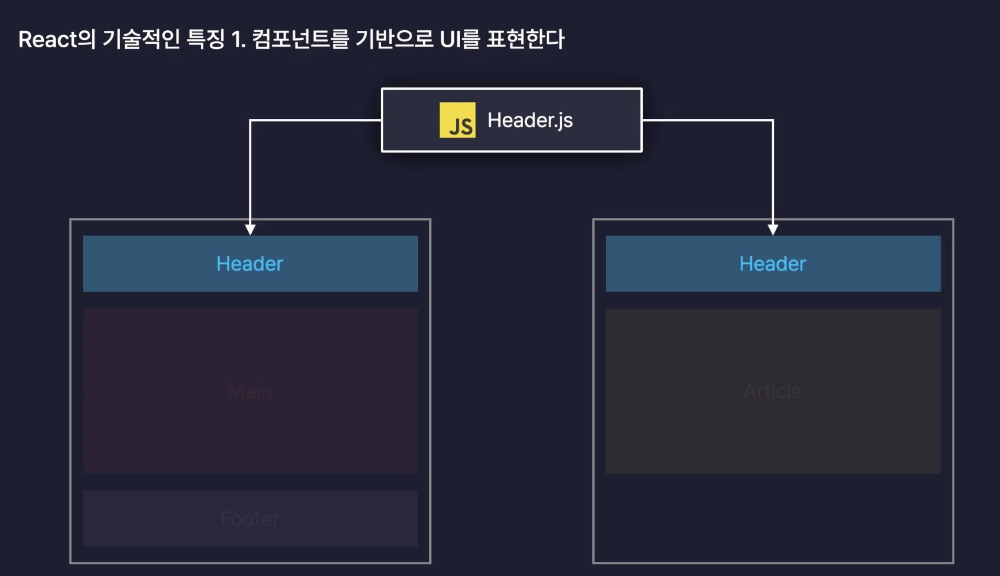

#### 2. 화면 업데이트 구현이 쉽다

- 선언형 프로그래밍
- 업데이트를 위한 복잡한 동작을 직접 정의할 필요 없이 특정 변수의 값(state)을 바꾸는 것만으로도 화면을 업데이트 시킬 수 있다.

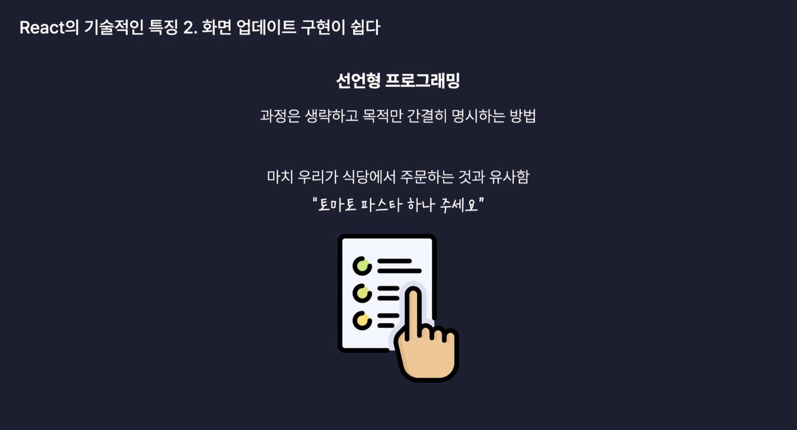

- 명령형 프로그래밍
  - 목적을 이루기 위한 모든 일련의 과정을 설명하는 방식
  - JavaScript

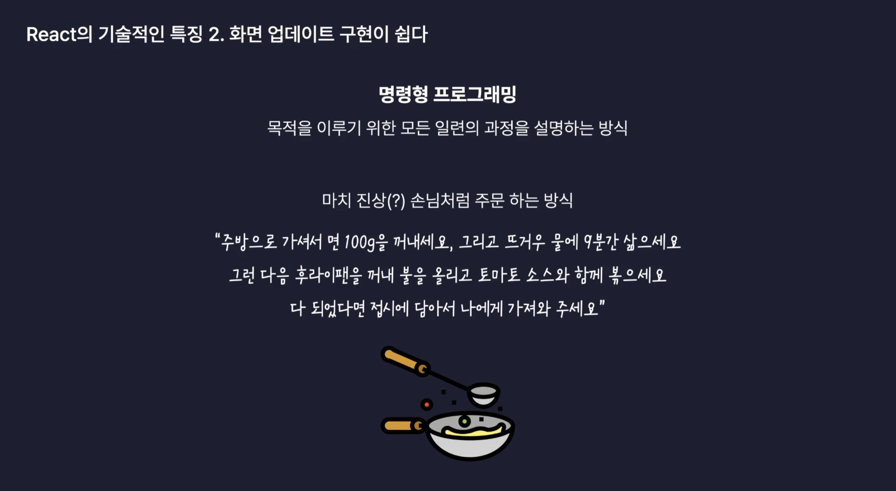

#### 3. 화면 업데이트가 빠르게 처리된다

- 브라우저의 렌더링 과정

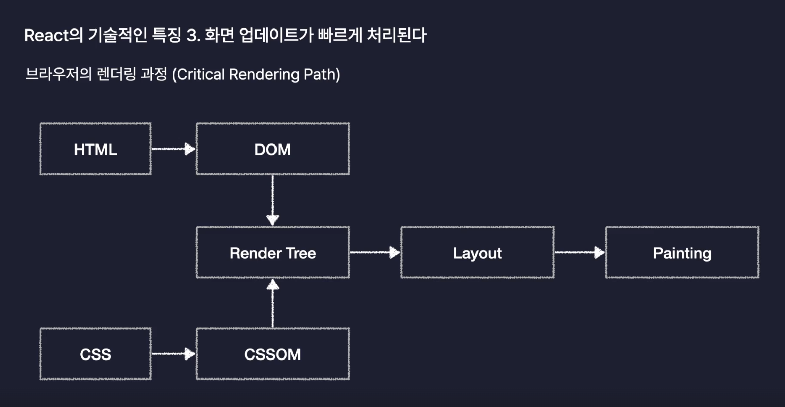

|Step1|Step2|Step3|Step4|
|:---:|:---:|:---:|:---:|
|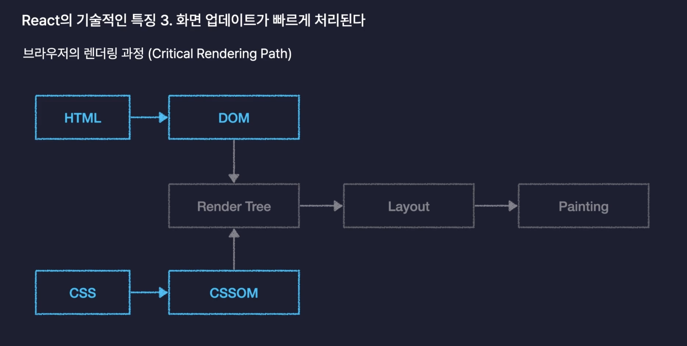|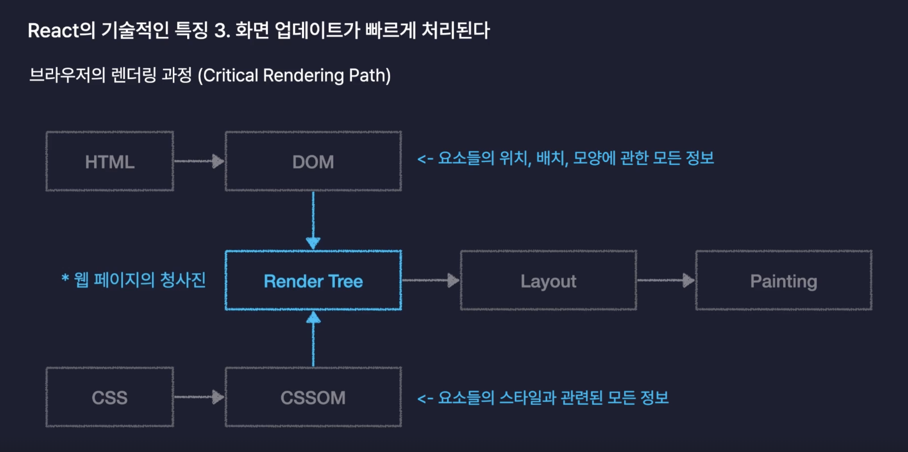|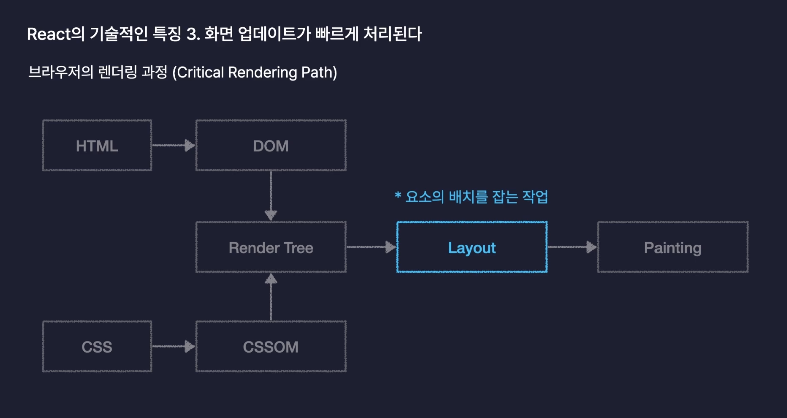|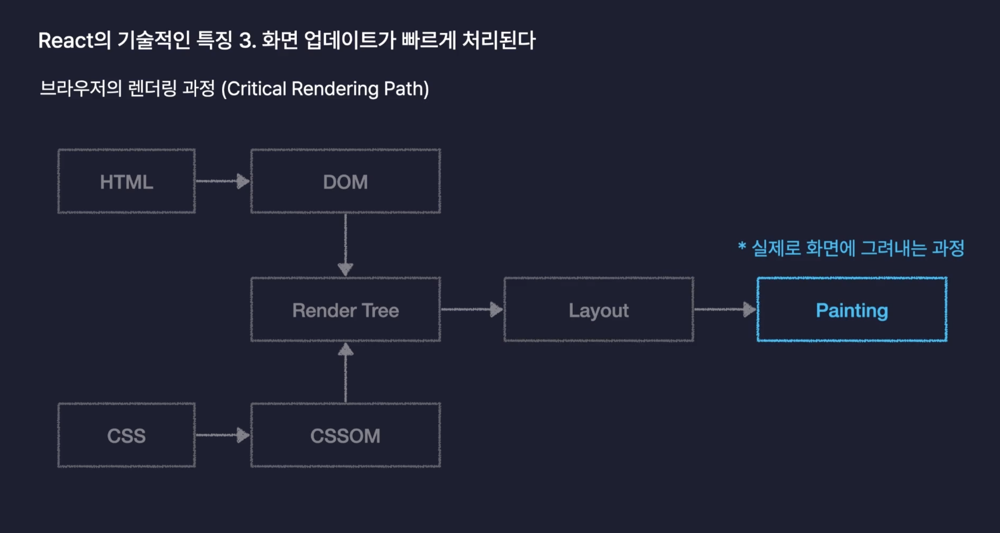|

- 화면의 업데이트의 과정
  - DOM을 수정하게 된다면 브라우저의 렌더링 과정 다시 실행하게 된다.
  
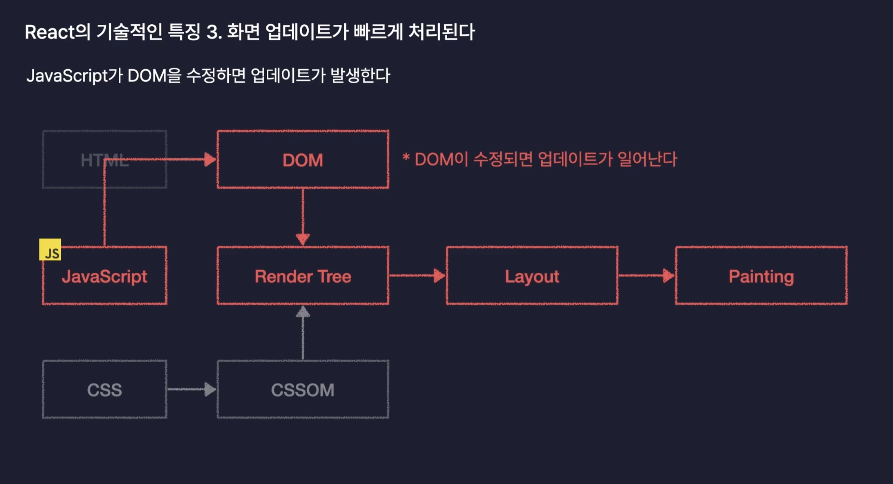

- 브라우저의 렌더링 과정중 Layout/Painting 오래 걸리는 과정이다.

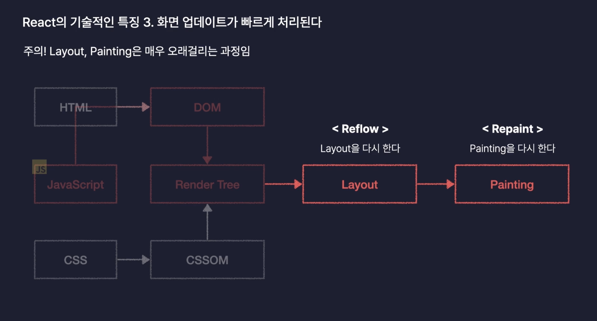

위의 과정을 최소화 하기 위해서는 동시에 발생하는 업데이트를 모아 한번에 수정 할 수 있도록 처리 해야한다.

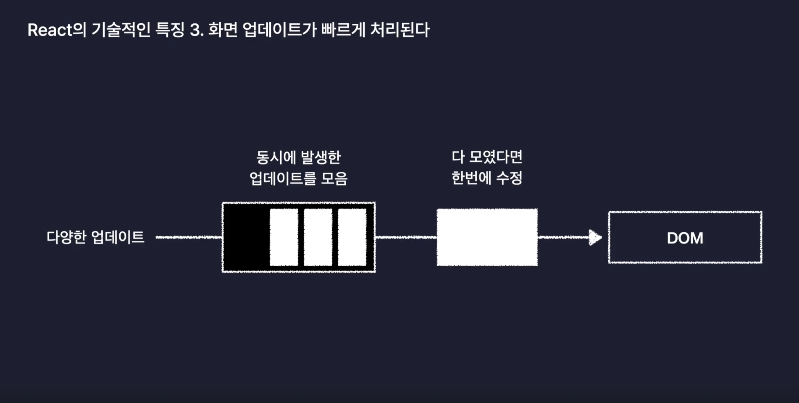

### VirtualDOM

- 리액트는 DOM 조작시 업데이트를 모아 한번에 수정 할 수 있도록 `가상의 DOM`을 활용해서 처리해준다.

#### 가상의 복제판 DOM === VirtualDOM

- DOM을 자바스크립트 객체로 흉내낸 것으로 일종의 복제판
- React는 업데이트가 발생하면 실제 DOM을 수정하기 전에 이 가상의 복제판 DOM에 먼저 반영

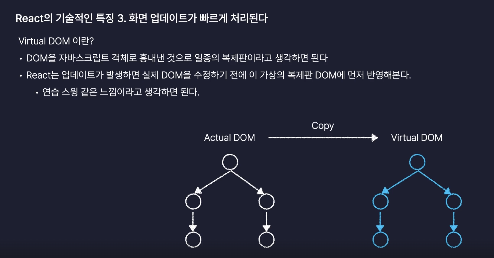

<br/>

## 2. React App 생성

- `Vite`
- 프론트엔드 개발 Tool
- React 공식문서에서 권장하고 있는 개발 도구

### ⚙️ 설치

```shell
npm create vite@latest
```

### ⚙️ package.json 정보를 기반으로 라이브러리 설치

```shell
npm i 
npm install
```

### 🗃️ 폴더 디렉토리

- `public`: 정적인 파일 보관소 ex. image,font ..
- `src` : source 약자 , react,js,ts 파일이 보관되는 장소 (추후 빌드될 파일들)
  - `assets` : public과 비슷하게 정적인 파일 보관소
- `eslintrc.cjs` : 개발자들 사이에서 코드 스타일을 통일하는데 도움을 주는 도구
- `.gitignore` : 깃관리 제외 시키는 파일
- `index.html` : 리액트 앱의 기본 틀

### 프로젝트 실행

```shell
npm run dev
```

<br/>

## 3. React App 구동원리

```shell
npm run dev
```

명령을 입력해서 리액트 앱을 구동 하니깐 `http://localhost:5173` 주소를 통해 리액트 앱에 접속할 수 있었다.

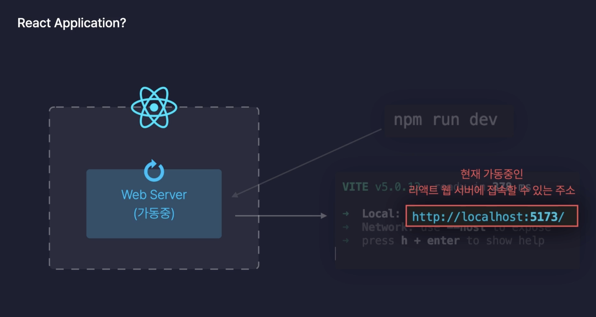

👉🏻 vite를 통해 웹서버가 내장되어 있었고, 명령어 입력을 통해 리액트 서버를 가동시켜서 접속 할 수 있는 주소를 받게 되었다.

### <http://localhost:5173>

- localhost : 자기 자신의 컴퓨터의 주소를 의미
- 5173 : 포트번호  

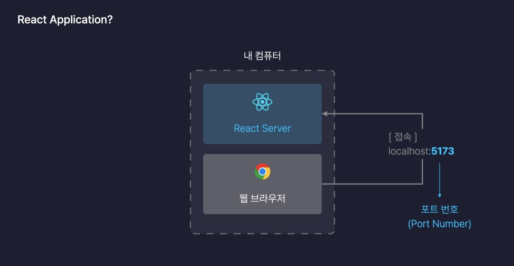

#### 🤔 port 번호는 다르다! 그 이유는?

- 내 컴퓨터에 여러개의 웹서버가 존재하고 있다면, 브라우저 요청에 응답하기 위해서는 고유의 포트 번호를 가지고 있어야
해당 서버를 찾아 응답을 받을 수 있다.

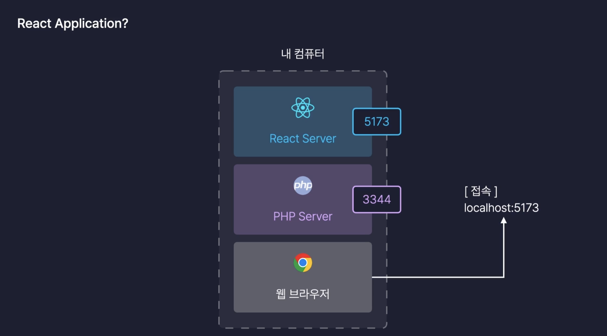

### index.html

```html
<body>
    <div id="root"></div>
    <script type="module" src="/src/main.tsx"></script>
</body>
```

- index.html 파일을 브라우저에 보내고 index.html 파일에서는 main.jsx 자바스크립트 파일을 실행이 자바스크립트 파일에서 ReactDOM.createRoot() 메서드는 인수로 받은 HTML 요소를 리액트의 루트로 만들어ㄷ준다. 그리고 render() 메서드를 통해 루트 아래에 컴포넌트가 리턴하는 html 요소를 화면에 렌더링 한다.
