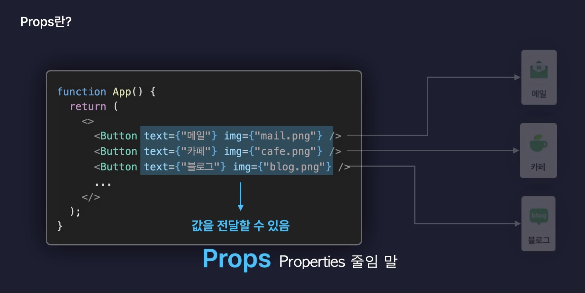

# React.js 입문

## 1. 실습 준비하기

### 불필요한 파일 제거

- App.tsx 정리
  - react.svg
  - vite.svg
- App.css 전체 삭제
- index.css 전체 삭제
- main.tsx
  - `React.StrictMode` 우선 기본 문법 사용에 혼란을 주기 때문에 삭제

### VScode extensions `ESLint` 설치

- `.eslintrc.cjs` 파일 옵션 추가

```js
  "no-unused-vars": 'off',  // 👈🏻 사용하지 않는 변수가 있을 때 오류로 알려주는 옵션
  "react/prop-types" : 'off'  // 👈🏻  React Prop Types 관련 옵션 
```

<br/>

## 2. React 컴포넌트 (Component)

### 함수컴포넌트

- 화살표 함수, 함수 선언식을 사용해서 만든다.
- 컴포넌트는 반드시 첫글자 `대문자`로 만들어줘야한다.
- 컴포넌트는 계층구조를 갖는다.
- 컴포넌트의 최상위 컴포넌트를 (Root) 컴포넌트라고 한다.
  - 보통은 App 컴포넌트를 루트컴포넌트로 둔다.

### 클래스컴포넌트

- 코드의 양이 어마어마하다.

### Components 디렉토리 생성

- src/components
- ES module 시스템을 쓰지만 import시 파일 확장자는 기재하지 않아도 된다.

<br/>

## 3. JSX

- 확장된 자바스크립트 문법
- 자바스크립트의 값을 HTML로 렌더링 해주고 싶다면 `{}`를 사용하면 된다.
  - 중괄호 안에는 숫자, 문자열값으로 평가될 수 있는 식이라면 모든지 사용 가능
  - 삼항연산자 사용도 사용 가능

### JSX 주의사항

- 중괄호 내부에는 자바스크립트 표현식만 넣을 수 있다.
  - if,for 문 사용 불가능
- 숫자, 문자열, 배열만 렌더링 된다.
  - 객체를 {} 중괄호 안에 넣으면 Error 발생
- 모든 태그는 닫혀있어야 한다.
- 최상위 태그는 반드시 하나여야만 한다.

```jsx

<h2></h2>
```

### style 적용법

- css를 객체 방식으로 작성하고 카멜 표기법으로 사용해야한다.

```jsx
export default function Main() {
  const user = {
    name: '홍길동',
    isLogin: true,
  };
  if (user.isLogin) {
    return <div style={{ backgroundColor: 'red' }}>로그아웃</div>;
  }
  return <div>로그인</div>;
  // return <>{user.isLogin ? <div>로그아웃</div> : <div>로그인</div>}</>;
}
```

- 컴포넌트와 동일한 이름의 css 파일 작성 후 import 모듈 시스템으로 파일 경로를 설정
  - `className`을 통해 css파일에 작성한 selector을 사용 할 수 있다.

```jsx
import './Main.css';

export default function Main() {
  const user = {
    name: '홍길동',
    isLogin: true,
  };
  if (user.isLogin) {
    return <div className="logout">로그아웃</div>;
  }
  return <div>로그인</div>;
  // return <>{user.isLogin ? <div>로그아웃</div> : <div>로그인</div>}</>;
}
```

<br/>

## 4. Props

- 컴포넌트에 props를 통해 전달하기
- properties의 줄임말



### defaultProps

- props의 기본값 속성을 지정해줄 수 있다.

```jsx
type ButtonProps = {
  text: string;
  color?: string;
};

const Button = (props: ButtonProps) => {
  console.log(props);
  return (
    <button type="button">
      {props.text} - {props.color}
    </button>
  );
};

Button.defaultProps = { // 👈🏻 color가 props로 전달 받지 못했을 경우
  color: 'black',
};

export default Button;
```

### `구조분해할당` 통해 사용

```jsx
type ButtonProps = {
  text: string;
  color?: string;
};

const Button = ({ text, color }: ButtonProps) => {
  return (
    <button type="button">
      {text} - {color}
    </button>
  );
};

Button.defaultProps = {
  color: 'black',
};

export default Button;
```

### `Spread`연산자를 사용해서 props 전달

```jsx
import './App.css';

import Button from './components/Button';

function App() {
  const buttonProps = {
    text: '메일',
    color: 'red',
  };
  return (
    <div>
      <Button {...buttonProps} />
      <Button text={'카페'} />
      <Button text={'블로그'} />
    </div>
  );
}
export default App;
```

### 자식요소를 children props로 전달 받을 수 있다  

```jsx
import './App.css';
import { ReactElement } from 'react';
import Button from './components/Button';

type ButtonProps = {
  text: string;
  color?: string;
  children?: ReactElement;
};

// 자식컴포넌트
const Button = ({ text, color, children }: ButtonProps) => {
  return (
    <button type="button">
      {text} - {color}
      {children}
    </button>
  );
};

Button.defaultProps = {
  color: 'black',
};

// 부모컴포넌트 
function App() {
  const buttonProps = {
    text: '메일',
    color: 'red',
  };
  return (
    <div>
      <Button {...buttonProps} />
      <Button text={'카페'} />
      <Button text={'블로그'}>
        <div>자식 Children</div>
      </Button>
    </div>
  );
}

export default App;
```

#### 🚨 주의 사항 : props는 `부모컴포넌트 → 자식컴포넌트`로만 전달 할 수 있다
