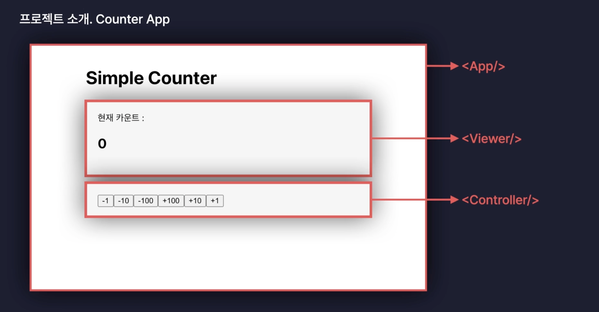
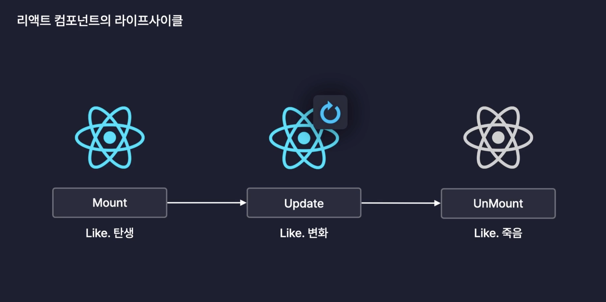
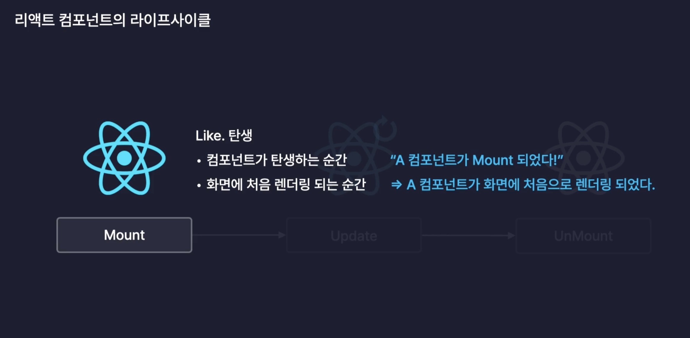
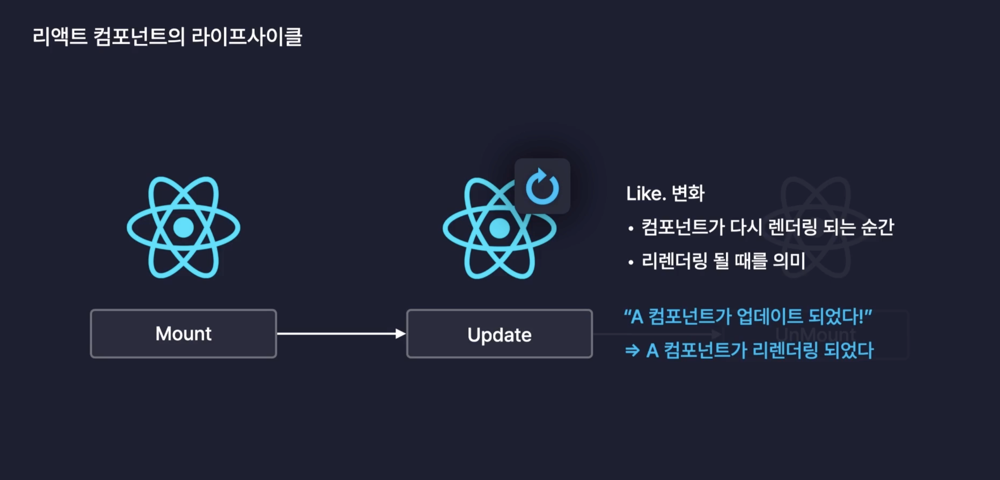
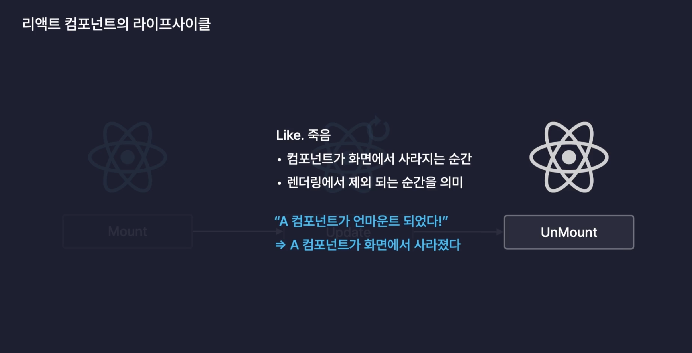

# 프로젝트1. 카운터 앱

### 1. 카운터 앱



#### 실습을 통해 알게 된 점

- 컴포넌트는 계층구조를 이루며 단방향 흐름을 가지고 있다.
  - 부모 → 자식으로 props를 전달하기 때문에
- 컴포넌트의 상태를 공유하기 위해서는 `공통 부모 컴포넌트`에서 상태를 가지고 있어야 한다. (State Lifting)

<br/>

# LifeCycle

- 생애주기

## 1. 리액트 컴포넌트의 라이프 사이클



### Mount

- 컴포넌트가 최초로 렌더링 된 상황을 의미



### Update

- 컴포넌트가 Mount 된 후 화면이 업데이트가 된 상황을 의미



### Unmount

- 컴포넌트가 렌더링에서 제외되는 상황을 의미



<br/>

## 2. useEffect

- 리액트 컴포넌트의 Side Effect를 제어하는 Hooks
- Side Effect를 제어한다.

### Side Effect

- 어떤 동작에 따라 `파생되는 효과`를 의미 한다.
- 함수가 Input에 따라 Output을 출력하는거 외에 모든 동작을 의미

<br/>

#### 리액트에서 Side Effect 제어 해야 하는 이유

- 상태의 변화에 따라 화면을 업데이트를 한 후 실행되어야 하는 이벤트를 처리하기 위해 제어 해야 한다.
- 상태 변화 값에 따라 DOM을 조작하거나 Data Fetch을 처리하는 등의 Side Effect를 일으켜야 하기 때문에

```javascript
/* eslint-disable react-hooks/exhaustive-deps */
import { useEffect, useState } from 'react';

import './App.css';

import Viewer from './components/Viewer';
import Controller from './components/Controller';

function App() {
  const [count, setCount] = useState(0);

  const handelOnClick = (number: number) => {
    setCount(count + number); // 비동기로 동작하기 때문에 상태변화값이 언제 실행 될지 파악 어려움
    console.log(`이벤트 핸들러의 함수내의 count : ${count}`); // 상태변화로 인해 업데이트 된 이전의 값 
  };

  // 랜더링이 된 이후 
  useEffect(() => {
    console.log(`useEffect 내의 count : ${count}`); // 상태변화의 업데이트 값을 확인할 수 있다. 
  }, [count]);

  return (
    <article className="App">
      <h1>Simple Counter</h1>
      <section>
        <Viewer count={count} />
      </section>
      <section>
        <Controller handelOnClick={handelOnClick} />
      </section>
    </article>
  );
}

export default App;

```

> 위의 코드로 알수 있는건, setCount함수로 업데이트된 상태를 사용하기위해서 useEffect를 통해 상태변화를 감지해서 콜백함수를 실행하게 하여 사용해야한다. 그이유 setCount 함수는 비동기로 동작되며 업데이트된 상태의 결과값을 반환 시점을 알수 없다.

```javascript
useEffect(() => {}, []) // 두번째 인자인 의존성배열(Dependency Array)

// 의존성 배열에 따라 콜백함수의 실행이 달라진다. 
```

<br/>

## 3. useEffect로 라이프 사이클 제어하기

### 1. Mount

- 의존성배열을 빈값으로 설정하면 화면이 최초 렌더링 되었을 떄만 해당 콜백함수가 실행됨

```javascript
useEffect(() => {
  console.log('Mount'); 
}, [])  
```

### 2. Update

- 의존성배열을 기재하지 않으면 최초 렌더링 Mount 되었을 때랑 화면이 업데이트 될 때 마다 실행됨

```javascript
useEffect(() => {
  console.log('Update'); 
}) 
```

- Mount 되는 시점을 포함하지 않고 화면이 Update 될 때만 콜백함수를 실행하고 싶을 경우

```javascript
const isMount = useRef(false); 

useEffect(() => {
  if(!isMount.current){
    isMount.current = true; 
    return; // 강제로 종료 
  }
  console.log('Update'); 
}) 
```

> 처음 랜더링 된 후 Mount된 시점에서는 isMount.current 값이 false이기에 부정연산자를 사용해서 true로 변경되어 if문이 실행된다. if내에서 isMount.current 값을 변경해주고 강제로 종료해줌으로써 처음 마운트 되었을 경우에는 console.log('Update')가 실행되지 않는다. 이후 상태값이 변경되어 화면 업데이트가 발생되면 useEffect의 콜백함수는 실행되는데 isMount.current값이 true이기 때문에 부정연산자로 false가 되어 if문 실행되지 않고, 콘솔로그가 출력된다.

### 3. UnMount

- 화면이 렌더링에서 제외되었을 경우 실행된다.

```javascript
useEffect(() => {
  console.log('Update'); 
  return () => {
    console.log('UnMount');
  }; 
}) 
```

> 해당코드를 실행해보면 Mount 되었을 때 Update 콘솔이 먼저 찍히고, 화면이 업데이트 되면 UnMount 콘솔이 실행되고 Update 콘솔이 찍히다. 리렌더링 되면
return문이 먼저 실행된다.
