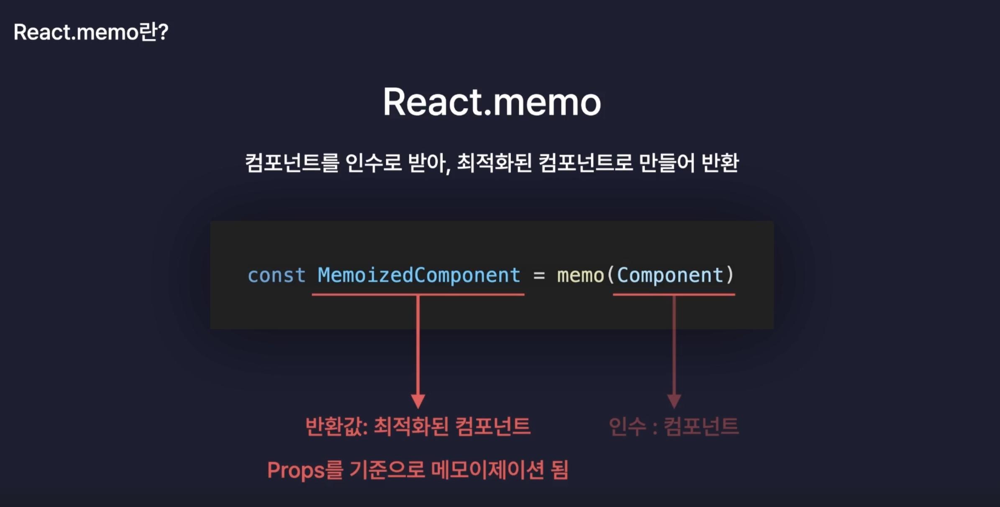
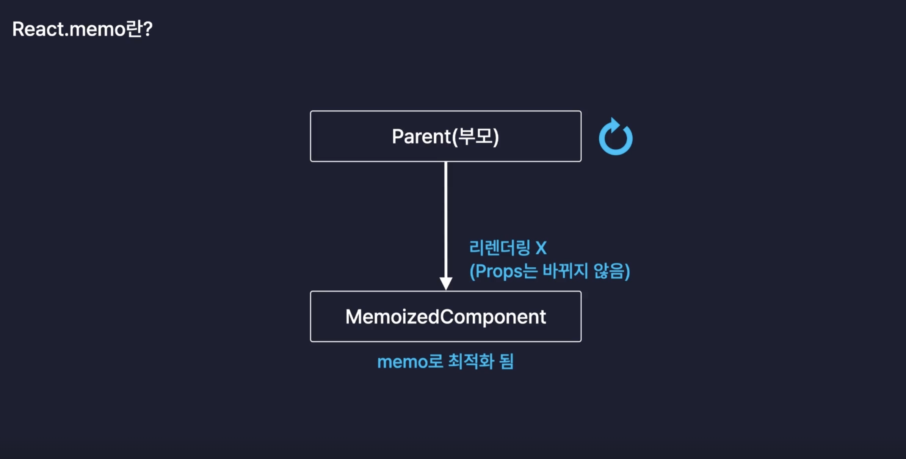
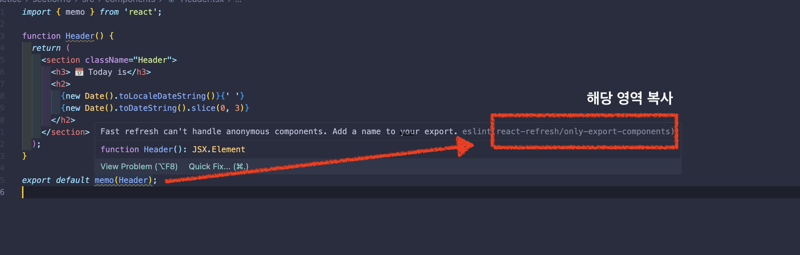
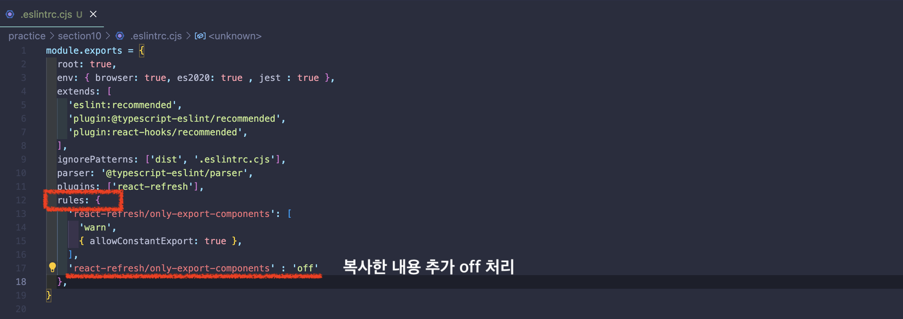

# 최적화

## 1. 최적화(Optimization)

- 웹 서비스의 성능을 개선하는 모든 행위를 일컫음

### 일반적인 웹 서비스의 최적화 방법

- 서버의 응답속도 개선
- 이미지,폰트,코드 파일등의 정적파일 로딩 개선
- 불필요한 네트워크 요청 줄임 ... 등

### React App 내부의 최적화 방법

- 컴포넌트 내의 불필요한 `연산` 방지
- 컴포넌트 내의 불필요한 `함수 재생성` 방지
- 컴포넌트 내의 불필요한 `리렌더링` 방지

<br/>

## 2. useMemo 와 연산 최적화

### useMemo

- `메모이제이션`기법을 기반으로 불필요한 연산을 최적화 해주는 hook

```jsx
useMemo(() => { return 결과값}, []) // 👈🏻 useMemo는 결과값을 반환한다. 의존배열이 빈값이라면 최조렌더링시에만 결과값 반환 
```

### Memoization

- 연산 작업의 결과값을 메모리에 저장해두었다가 동일한 연산작업 필요시 연산 해둔 결과값을 활용하는 기법

### TodoList 앱 최적화하기

- 현재 TodoList 불필요한 연산 작업이 없으므로 실습하기 위해 현재 Todo들의 상태를 분석해주는 함수 생성

```jsx
// src/components/List.tsx
function List({ todoList, onDelete, onUpdate }: ListProps) {

  // ..(중략) ... 

  const getAnalyzedData = () => {
    console.log('getAnalyzedData 호출!!');
    const totalCount = todoList.length;
    const doneCount = todoList.filter((todo) => todo.isDone).length;
    const notDoneCount = totalCount - doneCount;

    return {
      totalCount,
      doneCount,
      notDoneCount,
    };
  };

  const { totalCount, doneCount, notDoneCount } = getAnalyzedData();


  // ..(중략) ... 
}
```

> 🚨 getAnalyzedData 함수는 List 컴포넌트가 리렌더링 될 때마다 작업을 수행한다. 검색어 입력 후 결과를 반환하는 과정에서도 getAnalyzedData는 함수는 호출되어 연산 작업을 수행하고 있다.

```jsx
// src/components/List.tsx
function List({ todoList, onDelete, onUpdate }: ListProps) {

  // ..(중략) ... 

  // useMemo를 통한 최적화
  const { totalCount, doneCount, notDoneCount } = useMemo(() => {
    console.log('getAnalyzedData 호출!!');

    const totalCount = todoList.length;
    const doneCount = todoList.filter((todo) => todo.isDone).length;
    const notDoneCount = totalCount - doneCount;

    return {  // 👈🏻 결과값을 반환
      totalCount,
      doneCount,
      notDoneCount,
    };
  }, [todoList]);


  // ..(중략) ... 
}
```

<br/>

## 3. React.memo 와 컴포넌트 렌더링 최적화

### React. memo

- 컴포넌트를 인수로 받아 최적화된 컴포넌트로 만들어 반환해주고 최적화된 컴포넌트는 `Props`를 기준으로 메모이제이션 된다.



- 즉, 부모컴포넌트가 리렌더링이 발생되어도 props의 값이 변경되지 않으면 자식요소의 컴포넌트는 리렌더링 되지 않는다.



### TodoList 앱 최적화하기

- 최적화 대상 컴포넌드 : Header, ListItem
  - Header 컴포넌트 : 전달받은 props가 없음에도 최상위 App 컴포넌트가 리렌더링시 Header 컴포넌트도 리렌더링이 발생
  - ListItem : 체크박스를 토글시 대상의 형제 컴포넌트도 동일하게 리렌더링이 발생되고 있음.

#### Header 컴포넌트 리렌더링 방지

```jsx
import { memo } from 'react';

function Header() {
  return (
    <section className="Header">
      <h3> 📅 Today is</h3>
      <h2>
        {new Date().toLocaleDateString()}{' '}
        {new Date().toDateString().slice(0, 3)}
      </h2>
    </section>
  );
}

export default memo(Header);
```

<br/>

#### List 컴포넌트 리렌더링 방지

```jsx
import { memo } from 'react';

import { TodoItemType } from '../types';

type ListItemProps = {
  todo: TodoItemType;
  onDelete: (id: number) => void;
  onUpdate: (targetId: number) => void;
};

function ListItem({ todo, onDelete, onUpdate }: ListItemProps) {

  // ...(중략).... 

}

export default memo(ListItem);
```

> 🚨 React.memo를 통해 리렌더링이 방지되도록 처리해주었으나 여전히 형제요소들까지 리렌더링이 발생되었다. <br/> 그이유는 전달받은 props 중에 객체타입이 존재하기 때문이다. React.memo는 얇은복사를 통해 props 비교한다. ListItem 컴포넌트는 onDelete, onUpdate 함수를 props를 전달 받는데 객체타입인 메모리의 주소를 통해 얇은비교를 하기때문에 최상위 App 컴포넌트가 리렌더링 되면서 onDelete, onUpdate 새로운 함수를 생성되면서 새로운 메모리 주소를 전달받았기에 memo를 통해 최적화해도 형제요소들까지 리렌더링 발생되게 되었다.

#### 💡 해결 방법

- 두번째 인자의 콜백함수의 반환값에 따라 props변경을 감지하게 한다.
  - 두번째 인자는 생략가능하며, 생략하게 되면 memo 스스로가 props 변경을 감지
  - 이러한 memo를 `고차 컴포넌트` 라고 한다.

```jsx
import { memo } from 'react';

import { TodoItemType } from '../types';


type ListItemProps = {
  todo: TodoItemType;
  onDelete: (id: number) => void;
  onUpdate: (targetId: number) => void;
};

function ListItem({ todo, onDelete, onUpdate }: ListItemProps) {

  // ...(중략).... 

}

export default memo(ListItem, (prevProps, nextProps) => {
  // 반환값에 따라 props가 바뀌었는지 안바뀌었는지 판단
  // 콜백함수의 반환값을 True로 반환하게 되면 props가 바뀌지 않았다고 판단 -> 리렌더링 X
  // 콜백삼수의 반환값이 False로 반환하게 되면 props가 변경되었다고 판단 -> 리렌더링 O

  if (prevProps.todo !== nextProps.todo) return false;
  return true;
});
```

### 🍯 Tip) ESLint 경고 해결 방법

- EsLint 경고가 발생시 해결하고 싶다면 `.eslintrc.cjs` 파일내의 rules 영역에 추가해주면 된다.




<br/>

## 4. useCallback과 함수 재생성 방지

### useCallback

```jsx
useCallback(() => {}, []);
```

### TodoList 앱 최적화하기

> React.memo의 콜백함수로 props의 변경 상태를 감지하는것보다 더 나은 방법은 onDelete, onUpdate 함수를 새로운 함수로 생성되지 않도록 useCallback을 이용해 최적화한다.

#### 최상위 App 컴포넌트 내의 onDelete,onUpdate 최적화

```jsx
  const onCreate = useCallback((content: string) => {
    dispatch({
      type: 'CREATE',
      data: {
        id: idRef.current++,
        isDone: false,
        content,
        date: new Date().getTime(),
      },
    });
  }, []); // 👈🏻 최초 렌더링시에만 함수가 생성되도록 의존성 배열 빈값 

  const onUpdate = useCallback((targetId: number) => {
    dispatch({
      type: 'UPDATE',
      targetId: targetId,
    });
  }, []);

  const onDelete = useCallback((targetId: number) => {
    dispatch({
      type: 'DELETE',
      targetId: targetId,
    });
  }, []);
```

### 🤔 최적화는 언제 하는게 좋은가?

- 기능구현이 완료된 후 최적화 수행

### 🤑 최적화는 비용이 있기 마련이기에 꼭 필요한 상황에서만 수행

- [최적화 관련 아티클](https://goongoguma.github.io/2021/04/26/When-to-useMemo-and-useCallback/)
