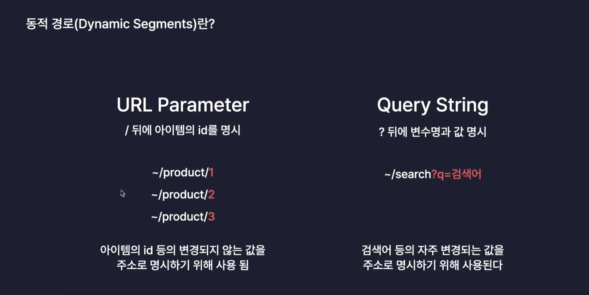

# 프로젝트3. 감정일기장

## 1. 프로젝트 소개 및 준비

- [감정일기장 DEMO](https://emotion-diary.winterlood.com/)
- DEMO의 프로젝트 실습

## 2. 페이지 라우팅

- 경로에 따라 알맞은 페이지를 렌더링 하는 과정

### 페이지 라우팅의 원리

- 브라우저에서 URL을 통해 페이지를 요청하면 서버가 응답해서 해당 페이지를 렌더링

### 기존의 방식 MPA

- 애초에 서버가 여러가지 페이지를 가지고 있는 방식

### SSR

- MPA방식에서 브라우저가 페이지 요청시 서버측에서 미리 렌더링한 페이지를 응답해주는 방식

> 🚨 기존의 MPA방식의 브라우저가 페이지를 요청하면 페이지를 응답하는 과정에서 기존페이지를 제거 후 새로운 페이지를 렌더링한다. 공통으로 사용되는 영역이 있음에도 불구하고 모두 새롭게 렌더링하는건 비효율이였고 서버에게 여러개의 요청을 보내게 되면 서버의부하가 걸리는 현상등이 발생하는 단점들이 존재했다..

### React의 새로운 방식 SPA

- MPA의 단점을 개선하고자 등장한 방식 싱글페이지어플리케이션
- 리액트에서는  서버가 초기 렌더링시 index.html 렌더링 해서 보내준 뒤 후속작업으로 컴포넌트들의 jsx 파일을 번들링해서 번들파일을 응답하게 한다.(이러한 파일을 이름을 React App 이라고 부른다.) 브라우저에서 페이지 요청이 들어오면 번들링 된 파일을 브라우저가 이용해서 필요한 컴포넌트만 교체하는 방식으로 동작한다.

### CSR

- SPA방식에서 페이지 요청시 브라우저가(클라이언트) 렌더링한 페이지를 응답해주는 방식

<br/>

## 3. 라우팅 설치

- 가장 많이 사용되고 있는 `react router` 라이브러리 사용

```shell
npm i react-router-dom
```

### 모든 컴포넌트가 라우터 정보를 공급받을 수 있도록 설정

- `BrowserRouter` : 모든 컴포넌트에게 URL 정보를 공급해주는 역활

```jsx
import ReactDOM from 'react-dom/client';

import { BrowserRouter } from 'react-router-dom';  // 👈🏻 BrowserRouter import

import App from './App.tsx';

import './index.css';

ReactDOM.createRoot(document.getElementById('root')!).render(
  <BrowserRouter> // 해당 컴포넌트로 감싸주게 되면 App 컴포넌트는 라우팅 할 수 있도록 location 객체 전달 받음 
    <App />
  </BrowserRouter>
);
```

### 경로에 따라 렌더링 되어야 하는 컴포넌트 설정

- `Routes` : URL의 정보를 확인 후 Route 컴포넌트 중 일치하는 정보를 찾아 컴포넌트 렌더링
  - Routes 컴포넌트의 자식 컴포넌트로 일반 컴포넌트 사용 불가
- `Route` : 경로를 지정, 경로에 맞는 컴포넌트 설정 하는 역활

```jsx
import { Routes, Route } from 'react-router-dom';

import './App.css';

import Home from './pages/Home'; // 👈🏻 컴포넌트 생성 (페이지 컴포넌트)
import New from './pages/New';
import Diary from './pages/Diary';
import NotFound from './pages/NotFound';

function App() {
  return (
    <Routes> // 👈🏻 Rotes 컴포넌트의 역활 : 페이지 URL의 정보를 확인 후 Route 컴포넌트의들 중 일치하는 정보 찾아 해당 컴포넌트 렌더링  
      <Route path="/" element={<Home />} /> // 👈🏻 URL "/" 이면 Home 컴포넌트 렌더링 
      <Route path="/new" element={<New />} />
      <Route path="/diary" element={<Diary />} />
      <Route path="*" element={<NotFound />} />
    </Routes>
  );
}
export default App;
```

### URL의 정보와 일치하지 않는 경로에 대한 처리

```jsx
import { Routes, Route } from 'react-router-dom';

import './App.css';

import Home from './pages/Home';
import New from './pages/New';
import Diary from './pages/Diary';
import NotFound from './pages/NotFound';

function App() {
  return (
    <Routes> 
      <Route path="/" element={<Home />} /> 
      <Route path="/new" element={<New />} />
      <Route path="/diary" element={<Diary />} />
      <Route path="*" element={<NotFound />} /> // 👈🏻 * 지정되지 않은 경로에 대해 NotFound 컴포넌트 렌더링 
    </Routes>
  );
}
export default App;
```

## 4. 페이지 이동

- `Link` : a태그처럼 링크를 통해 이동하기 위한 방식

```jsx
 <Link to={"URL"}></Link>
```

- `useNavigate` : 특정 이벤트를 통해 페이지 이동하기 위한 방식

```jsx
import { useNavigate } from 'react-router-dom';

import './App.css';

function App() {
  const nav = useNavigate();
  const handleClick = () => {
    nav('/diary');
  };
  return (
    <>
      <nav>
        <Link to={'/'}>Home</Link>
        <Link to={'/new'}>New</Link>
        <Link to={'/diary'}>Diary</Link>
      </nav>
      <div>
        <button type="button" onClick={handleClick}>
          클릭하면 Diary 페이지로 이동
        </button>
      </div>
    </>
  );
}

export default App;
```

<br/>

## 5. 동적 라우팅

### 동적 경로

- 동적인 데이터를 포함하고 있는 경로



- `URL Parameter` : / 뒤에 아이템의 id를 명시
  - 변경되지 않는 값을 주소로 명시하기 위해 사용 됨
- `Query String` : ? 뒤에 키와value로 명시
  - 자주 변경되는 값을 주소로 명시하기 위해 사용 됨

### URL Parameter 동적 경로 지정 및 사용하기

- /`:`과 함께 지정

```jsx
<Route path="/diary/:id" element={<Diary />} />
```

- `useParames` : 해당 컴포넌트에서 `id`값 얻기 위해 사용하는 hook

```jsx
import { useParams } from 'react-router-dom';

const Diary = () => {
  // url : '/diary/100'
  const param = useParams(); 
  console.log(param); // 👈🏻 // {id : 100}
  return <div>Diary : {param.id}</div>;
};

export default Diary;
```

### Query string 동적 경로 지정 및 사용하기

- `?`뒤에 key=value 값 지정

```jsx
import { Routes, Route, Link, useNavigate } from 'react-router-dom';

import './App.css';

import Home from './pages/Home';
import New from './pages/New';
import Diary from './pages/Diary';
import NotFound from './pages/NotFound';

function App() {
  const nav = useNavigate();
  const handleClick = () => {
    nav('/new?index=100'); // 👈🏻 동적 쿼리스트링 지정 
  };
  return (
    <>
        <button type="button" onClick={handleClick}>
          클릭하면 Diary 페이지로 이동
        </button>
      </div>
    </>
  );
}

export default App;
```

- `useSearchParams` : 해당 url의 key의 value를 얻기 위해 사용하는 hook
  - 배열의 첫번째 : params의 정보 객체 형태로 가지고 있음
  - 배열의 두번째 : key의 value값을 변경할 수 있는 함수

```jsx
import { useSearchParams } from 'react-router-dom';

const New = () => {
  const [params, setParams] = useSearchParams();
  console.log(params.get('index'));
  return <div>New : {params.get('index')}</div>;
};

export default New;
```
