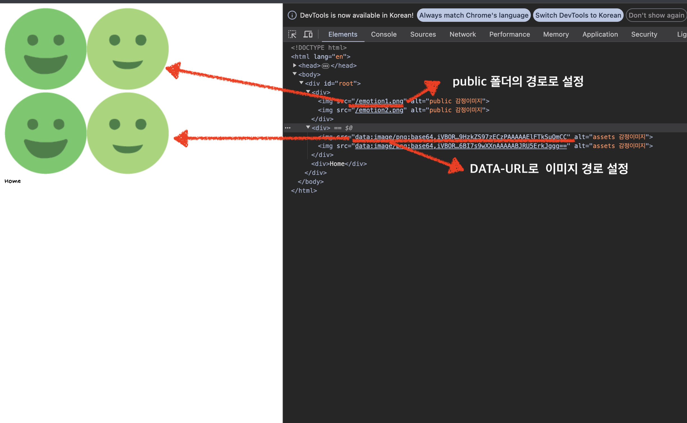
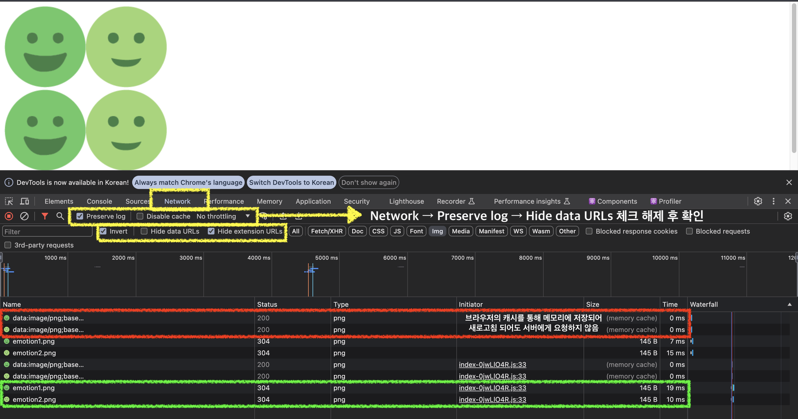

# 프로젝트3. 감정일기장

## 6. 폰트, 이미지, 레이아웃 설정하기

### 폰트

- `pulic`폴더 안에 font 파일 넣어주기
- index.css 에서 폰트 설정 및 적용

```css
@font-face {  /* 👈🏻 font-face 폰트 설정 */
  font-family: 'NanumPenScript';
  src: url('./../public/NanumPenScript-Regular.ttf');
}

body * {
  font-family: 'NanumPenScript', sans-serif;   /* 👈🏻 font 적용 */
}
```

### 이미지

- 이미지 파일은 두가지 폴더로 부터 사용가능하다.

- 1. `assets`
  - 브라우저의 캐시를 이용해서 이미지를 최적하기 위해서 사용하는 폴더 (Vite가 해당 폴더내의 이미지의 최적화를 지원)
  - 암호문 같음 포맷인 DATA-URL을 통해 설정된 이미지 주소들은 브라우저 메모리에 캐싱되어 페이지가 새로고침 되어도 다시는 불러오지 않는다.

- 2. `public`
  - 설정한 경로대로 서버로 부터 해당 파일을 요청하는 폴더

### ✅ assets vs public 차이점 확인하기

```jsx
import { Routes, Route } from 'react-router-dom';

import './App.css';

import Home from './pages/Home';
import New from './pages/New';
import Editor from './pages/Editor';
import Diary from './pages/Diary';
import NotFound from './pages/NotFound';

import emotion1 from './assets/emotion1.png'; // 👈🏻 assets폴더내의 이미지 사용시 import를 통해 사용 
import emotion2 from './assets/emotion2.png';

function App() {
  return (
    <>
      <div>
         // 👈🏻 public 폴더내의 경로 지정
        
      </div>
      <div>
        
        
      </div>
      <Routes>
        <Route path="/" element={<Home />} />
        <Route path="/new" element={<New />} />
        <Route path="/editor/:id" element={<Editor />} />
        <Route path="/diary/:id" element={<Diary />} />
        <Route path="*" element={<NotFound />} />
      </Routes>
    </>
  );
}

export default App;
```

- 프로덕션 모드로 파일 빌드

```shell
npm run build 
```

- 폴더 `dist`파일 웹서버 구동
- 실제로 배포할 때 해당파일을 배포하는 것

```shell
npm run preview
```




> 프로덕션 모드로 빌드를 통해 이미지의 경로를 확인헤보면 public 파일의 이미지는 지정한 경로로 배포되는 반면 assets 폴더는 이미지는 DATA-URL을 통해 암호화된 경로로 지정된다. DATA-URL로 지정된 경로는 페이자 새로고침 되어도 서버로 부터 데이터 요청을 하지 않고 메모리에 저장된 이미지를 사용해서 화면에 렌더링 되게 된다.  

### 🤔 이미지를 캐싱하는 이유?

> 브라우저는 웹페이지에 필요한 콘텐츠를 캐싱해 사본을 사용자가 접속중인 기기의 하드 드라이브에 저장한다. 이렇게 하면 다음번에 사용자가 같은 페이지에 접속했을 때, 필요한 대부분의 콘텐츠가 이미 로컬에 저장되어 있기에 페이지가 훨씬 더 빠르게 로드된다. 더불어 서버에 요청하는 데이터양이 줄어 네트워크 트래픽도 줄어든다.

### 🤔 모든 이미지 파일을 다 assets를 통해 이미지를 최적화 할까?

> ❎ 아니다. 천개 또는 만개가 넘는 이미지들을 assets 폴더를 사용하게 되면 브라우저에 저장해두게 되면 용량이 커지게 되면서 브라우저의 메모리 과부화 될 수 있다. 적절하게 사용하는게 좋다. (변경되지 않을 이미지들을 캐싱 처리)

### assets 폴더의 이미지를 일일이 import하지 말고 함수를 이용해 import 하자

```ts
import emotion1 from '../assets/emotion1.png';
import emotion2 from '../assets/emotion2.png';
import emotion3 from '../assets/emotion3.png';
import emotion4 from '../assets/emotion4.png';
import emotion5 from '../assets/emotion5.png';


export function getEmotionImages(emotionId : number){
  switch(emotionId){
    case 1 : return emotion1;
    case 2 : return emotion2;
    case 3 : return emotion3;
    case 4 : return emotion4;
    case 5 : return emotion5;
    default : return `none-image`;
  }
}
```

<br/>

## 7. 공통 컴포넌트 구현

### 버튼 : Button.tsx

- 버튼 스타일 타입별로 지정해둔 클래스명을 props로 전달해서 동적으로 변경 될 수 있도록 모듈화

### 헤더영역 : Header.tsx

- 위치하는 영역별로 Child 컴포넌트 props로 적용하여 모듈화

<br/>

## 8. 일기 관리 기능 구현하기 - 1

### 일기 Editor 영역 추가 작업

### mockDate 및 일기 데이터 관리를 위한 준비 작업

```jsx
import { useReducer } from 'react';
import { Routes, Route } from 'react-router-dom';

import './App.css';

import Home from './pages/Home';
import New from './pages/New';
import Diary from './pages/Diary';
import Editor from './pages/Editor';
import NotFound from './pages/NotFound';

import { TodoItemType } from './types';

const mockDate = [
  {
    id: 1,
    createdDate: new Date().getTime(),
    emotionId: 1,
    content: '1번 일기 내용',
  },
  {
    id: 2,
    createdDate: new Date().getTime(),
    emotionId: 2,
    content: '2번 일기 내용',
  },
  {
    id: 3,
    createdDate: new Date().getTime(),
    emotionId: 3,
    content: '3번 일기 내용',
  },
];

function reducer(state: TodoItemType, action) {
  return state;
}

function App() {
  const [data, dispatch] = useReducer(reducer, mockDate);

  return (
    <>
      <Routes>
        <Route path="/" element={<Home />} />
        <Route path="/new" element={<New />} />
        <Route path="/diary/:id" element={<Diary />} />
        <Route path="/editor/:id" element={<Editor />} />
        <Route path="*" element={<NotFound />} />
      </Routes>
    </>
  );
}

export default App;
```

<br/>

## 9. 일기 관리 기능 구현하기 - 2

### 새로운 일기를 추가하는 `onCreate`

```jsx
  const [data, dispatch] = useReducer(reducer, mockDate);
  const idRef = useRef(3);

  const onCreate = (
    createdDate: number,
    emotionId: number,
    content: string
  ) => {
    dispatch({
      type: 'CREATE',
      data: {
        id: idRef.current++,
        createdDate,
        emotionId,
        content,
      },
    });
  };
```

### 기존 일기를 수정하는 `onUpdate`

```jsx
  const onUpdate = (
    id: number,
    createdDate: number,
    emotionId: number,
    content: string
  ) => {
    dispatch({
      type: 'UPDATE',
      data: {
        id,
        createdDate,
        emotionId,
        content,
      },
    });
  };
```

### 기존 일기를 삭제하는 `onDelete`

```jsx
const onDelete = (id: number) => {
    dispatch({
      type: 'DELETE',
      id,
    });
  };
```

### 상태와 이벤트 함수를 Context를 이용해서 공급

```jsx
  //..(중략).. 
  
  const DiaryStateContext = createContext<TodoItemType[]>([]);
  const DiaryDispatchContext = createContext({});

  //..(중략).. 

  return (
      <DiaryStateContext.Provider value={data}>
        <DiaryDispatchContext.Provider value={{ onCreate, onUpdate, onDelete }}>
          <Routes>
            <Route path="/" element={<Home />} />
            <Route path="/new" element={<New />} />
            <Route path="/diary/:id" element={<Diary />} />
            <Route path="/editor/:id" element={<Editor />} />
            <Route path="*" element={<NotFound />} />
          </Routes>
        </DiaryDispatchContext.Provider>
      </DiaryStateContext.Provider>
  );
```
